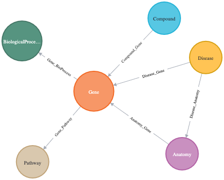

# Chemotherapeutics in  biliary tract cancer: Application of network analysis

The aim of this project was to apply expert-augmented network analysis to for Drug Repurposing in the Bile tract cancer. 
This was achieved by 

-  Generation of a  graph database for a subset of [Hetionet](https://het.io/#:~:text=Hetionet%20is%20an%20integrative%20network,2%2C250%2C197%20relationships%20(24%20types).)  data centered on bile tract cancer.
-  Conduct a thorough analysis of the knowledge graph  using graph algorithms.  
- Interpret results of the analysis and identify interesting associations between the disease and the therapeutic agents.


## Table of content

- [Background](Bile tract cancer)
    - [Bile tract cancer](#Bile tract cancer)
    - [Graph theory](#Graph theory)
- [Methodology](#Analysis workflow)
    - [Data](#Data)
    - [Graph algorithms](#Graph algorithms)
    - [Analysis workflow](#Analysis workflow)
    - [Tools](#Tools)
- [Results and discussion](#page-setup)


### Bile tract cancer


### Graph theory

[]


### Data
### Graph algorithms
### Analysis workflow


### Tools

The R version 4.1.2 (2021-11-01) -- "Bird Hippie" was used for the project. The packages used were:


- [`neo4r`](https://cran.r-project.org/web/packages/neo4r/index.html): Neo4J Driver, allowing you to query data on  Neo4J server and handle the results in R.
- [`tidyverse`](https://www.tidyverse.org/):Packages for data science.
-[`ggplot2](https://ggplot2.tidyverse.org/):  A system for declaratively creating graphics
- [`ggthemes`](https://yutannihilation.github.io/allYourFigureAreBelongToUs/ggthemes/): ggplot2 extension.
- [`PupillometryR`](https://cran.r-project.org/web/packages/PupillometryR/index.html)
- `cowplot`
- `ggdist`


### Neo4j

**Note:** Neo4J version 4.4.3


## Codes

Setup TYPO3 as normal by creating a `FIRST_INSTALL` file in the `./public` directory:

```bash
touch public/FIRST_INSTALL
```

Open the URL of your installation in the browser and follow the steps in the TYPO3 setup scripts.


```
Two files contain the codes:

  - Codes: R codes that contain the graph analysis codes.
  - Report: Markdown file for the presentation.
  - createPDF: R code to compile the markdown report.
```


## Links

* [Web site](https://aimeos.org/integrations/typo3-shop-extension/)
* [Documentation](https://aimeos.org/docs/TYPO3)
* [Forum](https://aimeos.org/help/typo3-extension-f16/)
* [Issue tracker](https://github.com/aimeos/aimeos-typo3/issues)
* [Source code](https://github.com/aimeos/aimeos-typo3)
