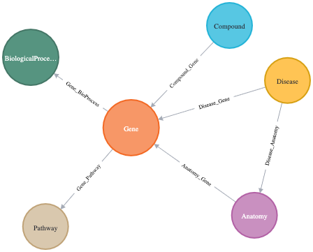
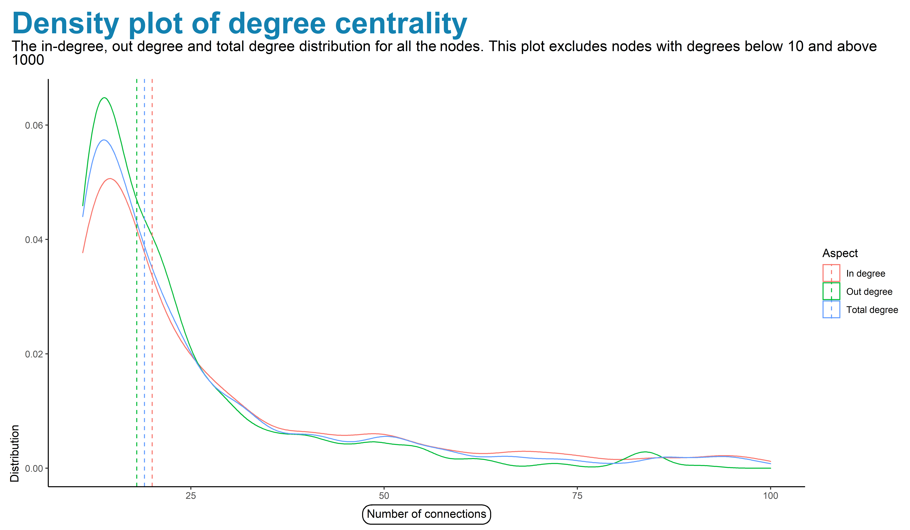
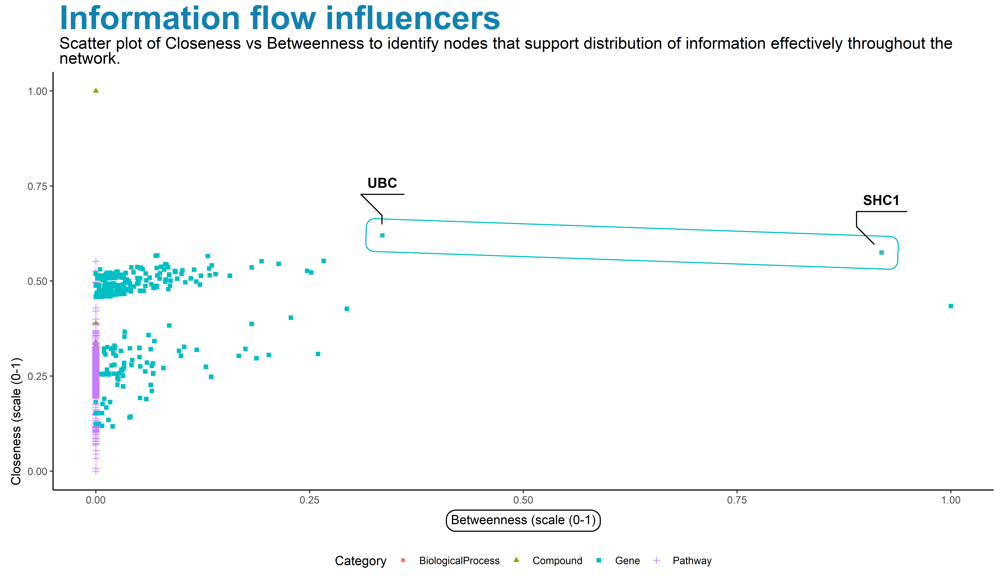
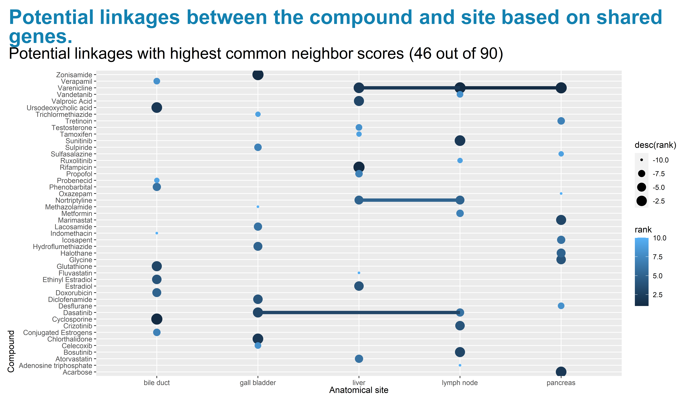
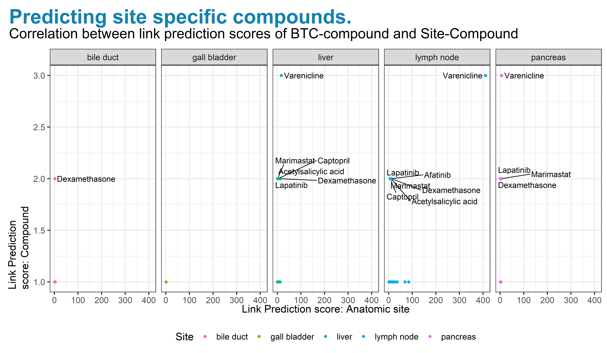

```{r setup, include=FALSE}
options(htmltools.dir.version = FALSE)
knitr::opts_chunk$set(comment = NA)
knitr::opts_chunk$set(warning =FALSE)
knitr::opts_chunk$set(error =FALSE)
knitr::opts_chunk$set(message = FALSE)
knitr::opts_chunk$set(
  fig.width=9, fig.height=3.5, fig.retina=3,
  out.width = "100%",
  cache = FALSE,
  echo = TRUE,
  message = FALSE, 
  warning = FALSE,
  hiline = TRUE
)
```

```{r xaringan-themer, include=FALSE, warning=FALSE}
library(xaringanthemer)
style_duo_accent(
  primary_color = "#1381B0",
  secondary_color = "#FF961C",
  inverse_header_color = "#FFFFFF"
)
```


```{r connection_import, include=FALSE, warning=FALSE}

library(neo4r)
library(dplyr)
library(purrr)
library(tidyverse)
library(ggthemes)
library(PupillometryR)
library(cowplot)
library(ggdist)
library(ggrepel)
library(ggtext)
library(scales)
library(ggtext)
library(grid)
library(gridExtra)
library(kableExtra)
library(gfonts)
library(igraph)
library(ggraph)
library(bookdown)

options(ggrepel.max.overlaps = Inf)

# Note that play_movies is only available for versions >= 0.1.3 

```


## Biliary tract cancer (BTC) or Cholangiocarcinoma (CC)

#### Cluster of highly heterogeneous & aggressive malignant tumours that can arise at any point of the biliary tree. 


.pull-left[
*Fig 1.Anatomic classification of BTC. Reproduced from [Banales et al](https://www.nature.com/articles/s41575-020-0310-z) <sup>1</sup>*
]

.pull-right[
Highlights:
  - Low survival rates (5-year survival rate for metastatic disease being only 2%).
  - Prevalence increasing globally ( accounts for ~15% of all primary liver cancers and ~3% of gastrointestinal malignancies).
  - High heterogeneity at the genomic, epigenetic and molecular levels severely compromises the efficacy of the available therapies.
  - Limited treatment options.
]  

---

## Overview of BTC gene landscape

#### Whole genone sequencing studies have improved the understanding of the causal mechanisms in BTC, highlighting the genomic complexity.


1. Mutations leading to DNA damage and genomic instability (TP53, CDKN2A, CCND1, ATM, ROBO2, BRCA1 and BRAC2); 

2.  Deranged epigenetic regulation(IDH1 and IDH2 and MYC amplification);

3. de-ubiquitination (BAP1,PBRM1, ARID1A, ARID1B, ARID2, SMARCA2, SMARCA4 and SMARCAD1);
 
4. histone (de-)methylation (MLL2, MML3, KMT2C, KDM4A, KDM5D, KDM6A and KDM6B); 

5. kinase signalling (KRAS, ERBB1–3, BRAF, PIK3CA, PTEN, STK11, SMAD4 and FGFR1–3); 

6. immune dysregulation (JAK–STAT3 signalling,  FGFR2 and PRKCA–PRKCB fusions); 

7. Others  - WNT–CTNNB1 pathway (APC); Hippo signalling (NF2, SAV1 deletion); METLL13 amplifications; 


---
## Mutational signature analysis in BTC

#####  There are marked differences in the genomic features depending on the anatomical location and risk factors. 
- Some examples of the  differences in the mutations include:<sup>1,2</sup>.

 > Small bile duct BTC is often  characterized by IDH1, IDH2  mutations or FGFR2 fusions. 
 
 > By contrast, large bile duct,pCCA and dCCA , shows a high frequency of mutations in KRAS and/or TP53 genes. 
 

- Growing evidence demonstrates that distinct cells of origin within an organ can give rise to different sub-types of cancer.


- These findings could be useful to establish treatment and diagnostic strategies for BTCs based on genetic profile.

---

## Therapeutic and prognostic importance of genetic signature.


- Liquid biopsy detection of cfDNA  and miRNAs  of mutated genes is  a routine clinical diagnostic procedure and/or prognostic indicator of BTC. 

- Immununotherapy with either chemotherapy or targeted therapy or loco regional therapies such as transarterial chemoembolization (TACE), cryotherapy, radiofrequency ablation (RFA), and radiotherapy is done based on the genetic mutations.

- Relevant genes and proteins involved in chemo-resistance therefore need to be ruled out.  


---

## Problem statement

Different anatomical sites and genetic aberrations contribute to BTC heterogeneity.These  BTC sub types have different prognosis and response to therapy. 
<br>
This analysis seeks to identify the crucial genes in BTC and thereafter identify potential linkages with  site specific  chemotherapeutic compounds.


---
## Objectives

#### Identify potential site-stecific therapeutic opportunities.


1. What are the most essential genes associated with BTC? 
2. Which therapeutic compound can potentially be used to treat BTC based on the shared genes?
3. Which are the potential site specific therapeutic compounds based on the shared genes?


---
## Methodology

1. Social network analysis
  - Network level measures.
  - Node-level measures:
      - Degree centrality.
      - Betweenness centrality.
      - Closeness centrality.
  - Link prediction:  Common neighbors.

2. Tools: 
  - Neo4J.
  - neo4r package was used to query data from the  'Neo4J' server and handle the results in R.

???

_if not asked to lend money_.
---
## Dataset

#### Subset of Hetionet data centered on  Biliary Tract Cancer.

Hetionet is an integrative network of biomedical knowledge  combining information from 29 public databases.  The network combines over 50 years of biomedical information into a single resource, consisting of 47,031 nodes (11 types) and 2,250,197 relationships (24 types)<sup>3</sup>.

```{r, readdata, echo=FALSE, warning=FALSE}


## Graph statistics
basicStats<- read.csv("Data/basicStats.csv")

Stats<-read.csv("Data/Stats.csv")
schema <- read.csv("Data/metadata.csv")
#schema
#schema<- rename(schema, Triples = Number.of.triples)
#schema<- rename(schema, Relationship = Relation)
names(schema)[names(schema) == "Number.of.triples"] <- "Triples"
names(schema)[names(schema) == "Relation"] <- "Relationship"


schema
#knitr::kable(schema)

#schema %>%
#  kbl(caption = "Datasets used in the analysis") %>%
#  kable_paper(full_width = F)%>% 
#  footnote(number = c(" As Provided"))  

## https://kelseyandersen.github.io/NetworksPlantPathology/Describing_Networks.html
## Summary of the network

## The density is the measure of how many ties between actors exist compared to the possible number.


```
---

layout: false

## Metagraph

<center></center> *Fig 1.Metagraph showing the types of nodes used to build the network and the types of links defined to connect the nodes. Reproduced as provided by ALI DAWOOD*

---

## Size of the network

#### This was a directed graph with a  total of `r filter(basicStats, Aspects=='Nodes')$Statistics` nodes and `r filter(basicStats, Aspects=='Relationships')$Statistics` edges. 


.left-column[
| Measure     | Value |
|-------------|-------|
| Gene nodes       | `r filter(basicStats, Aspects=='Genes')$Statistics`      |
| Compound nodes    | `r filter(basicStats, Aspects=='nCompound')$Statistics`        |
| Disease nodes    |  `r filter(basicStats, Aspects=='nDisease')$Statistics`        |
| Biological Process nodes    | `r filter(basicStats, Aspects=='nBiologicalProcess')$Statistics`        |
| Pathway nodes    |   `r filter(basicStats, Aspects=='Pathway')$Statistics`       |
]

.right-column[

| Measure     | Value |
|-------------|-------|
| Genes and Diseases |  `r filter(basicStats, Aspects=='gRd')$Statistics`      |
| Compounds and Diseases       |  0      |
| Disease and Anatomy    |   `r filter(basicStats, Aspects=='dRa')$Statistics`     |
| Anatomy and Gene    |   `r filter(basicStats, Aspects=='aRg')$Statistics`     |
| Gene and Biological Process    |`r filter(basicStats, Aspects=='gRb')$Statistics`        |
| Gene and Pathway    |  `r filter(basicStats, Aspects=='gRp')$Statistics`      |
]

---
class:full
#### <p style="color:#1381B0">Network has 3350 unique communities, with 2794 being isolated nodes. The community membership agaist the size is demonstrated below.</p>
.

<center></center> 

---
class:full

<center></center> 

---
class: full

<center></center> 

---
class: full

<center></center> 

---
class: full

<center></center> 
---
class: full


class: full

### Subgraph with the five most influential genes
```{r figSvg,eval=TRUE,echo=FALSE,message=FALSE, error=FALSE, warning=FALSE,fig.height=4}

library(cowplot)
fig_svg<-cowplot::ggdraw()+cowplot::draw_image("Data/mainNodes_5.svg")
plot(fig_svg)
```


---

class:full
<center></center> 
---
### Link prediction between compounds and BTC based on shared genes.

##### The strength of the linkage is represented by the size of the word.

```{r, drugs,warning=FALSE, echo=FALSE}
diseaseDrugRank<-read.csv("Data/diseaseDrugRank.csv")
wordCount<-diseaseDrugRank %>% 
  mutate(word=Name, freq=value) %>% 
  select(word,freq)
library("wordcloud")
library("RColorBrewer")
library(wordcloud2)

set.seed(1234)

wordcloud(words = diseaseDrugRank$Name, freq = diseaseDrugRank$value, # words
          min.freq = 0,colors=brewer.pal(8, "Dark2"),
          scale=c(1.2,.5),
           max.words=200, random.order=FALSE,
 rot.per = 0.3) 

```

---

class: full

<center></center> 


---

name: colors

### Genomic landscape of BTC 

.left-column[
Influential genes

`UBC`

`FYN`

`NUP85`

`SHC1`

`MYC`

]

.right-column[
- Aberrations in three of these genes have been associated in the pathogenesis  of BTC - MYC<sup>1</sup>,UBC <sup>1</sup> FYN<sup>4</sup>

- NUP85 is a low tissue specific gene, but has been attributed to poor prognosis of gastrointestinal cancers<sup>4</sup>. 
 

- SHC1 is a also a low tissue specific gene, but has been attributed to poor prognosis of renal, lung and cervical cancers<sup>4</sup>.
]

---
## Drug target prediction by leveraging on gene network.

####`Varenicline:`Used for smoking cessation.Has been associated with negative effects among cancer patients.

####`Dexamethasone:` Associated with hepatic injury.

####`Afatinib:`Some ongoing trials as an add on to chemo-therapy naive patients with advanced BTC.

####`Lapatinib:`This drug has been shown to be effective in the  BTC cases showing HER2/neu mutations.

####`Captopril:`Indicated for hypertension but, there are trials for use in cancer.

####`Marimastat:`Though not used for BTC, it is conventionally used for other GIT cancers.

---
### Conclusion

- While the role of the three genes (MYC,UBC and FYN) is potentially associated with the pathology of BTC,the strong links to the two other genes (SHC1 and NUP85) maybe attributed to likelihood of metastasis from neighboring organs. 

- Considering the compounds, the following can be deduced:
<br>
<span style="color:green"> Drugs indicated for use: Lapatinib</span>.
<br>
<span style="color:orange"> Potentially useful drugs: Afatinib, Captopril (Liver and lymph nodes) and Marimastat(liver,Pancreas)</span>.
<br>
<span style="color:red"> Potentially harmful drugs: Varenicline and Dexamethasone</span>.

---
## References:

1. Banales, J.M., Marin, J.J.G., Lamarca, A. et al. Cholangiocarcinoma 2020: the next horizon in mechanisms and management. Nat Rev Gastroenterol Hepatol 17, 557–588 (2020). https://doi.org/10.1038/s41575-020-0310-z

2. Farshidfar, Farshad et al. “Integrative Genomic Analysis of Cholangiocarcinoma Identifies Distinct IDH-Mutant Molecular Profiles.” Cell reports vol. 18,11 (2017): 2780-2794. doi:10.1016/j.celrep.2017.02.033

3. Heterogeneous Network Edge Prediction: A Data Integration Approach to Prioritize Disease-Associated Genes
Himmelstein DS, Baranzini SE PLOS Computational Biology (2015) DOI: 10.1371/journal.pcbi.1004259 · PMID: 26158728 · PMCID: PMC4497619

4. Zou S, Li J, Zhou H, Frech C, Jiang X, Chu JSC, et al. Mutational Landscape of Intrahepatic Cholangiocarcinoma. Nat Commun (2014) 5(1):5696. doi: 10.1038/ncomms6696.

5. Xia, R., Tang, H., Shen, J. et al. Prognostic value of a novel glycolysis-related gene expression signature for gastrointestinal cancer in the Asian population. Cancer Cell Int 21, 154 (2021). https://doi.org/10.1186/s12935-021-01857-4


---
class: center, middle

# Thanks!

Project repository:

[em-kagereki/Graph-analysis](https://github.com/em-kagereki/Graph-analysis)

