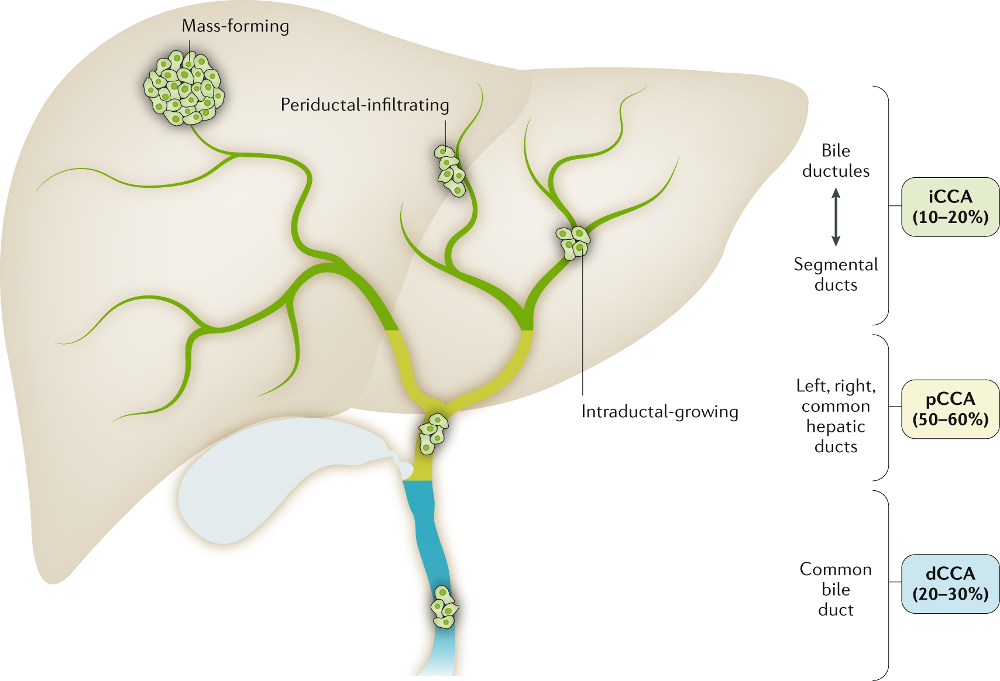

```{r setup, include=FALSE}
options(htmltools.dir.version = FALSE)
knitr::opts_chunk$set(comment = NA)
knitr::opts_chunk$set(
  fig.width=9, fig.height=3.5, fig.retina=3,
  out.width = "100%",
  cache = FALSE,
  echo = TRUE,
  message = FALSE, 
  warning = FALSE,
  hiline = TRUE
)
```

```{r xaringan-themer, include=FALSE, warning=FALSE}
library(xaringanthemer)
style_duo_accent(
  primary_color = "#1381B0",
  secondary_color = "#FF961C",
  inverse_header_color = "#FFFFFF"
)
```


```{r connection_import, include=FALSE, warning=FALSE}

library(neo4r)
library(dplyr)
library(purrr)
library(tidyverse)
library(ggthemes)
library(PupillometryR)
library(cowplot)
library(ggdist)
library(ggrepel)
library(ggtext)
library(scales)
library(ggtext)
library(grid)
library(gridExtra)
library(kableExtra)
library(gfonts)
library(igraph)
library(ggraph)
library(bookdown)

options(ggrepel.max.overlaps = Inf)

# Note that play_movies is only available for versions >= 0.1.3 

```


## Biliary tract cancer (BTC) or Cholangiocarcinoma (CC)

#### Cluster of highly heterogeneous & aggressive malignant tumours that can arise at any point of the biliary tree. 


.pull-left[
*Fig 1.Anatomic classification of BTC. Reproduced from [Banales et al](https://www.nature.com/articles/s41575-020-0310-z) <sup>1</sup>*
]

.pull-right[
Highlights:
  - Low survival rates (5-year survival rate for metastatic disease being only 2%).
  - Prevalence increasing globally ( accounts for ~15% of all primary liver cancers and ~3% of gastrointestinal malignancies).
  - High heterogeneity at the genomic, epigenetic and molecular levels severely compromises the efficacy of the available therapies.
  - Limited treatment options.
]  

---

## Overview of BTC gene landscape

#### Massive sequencing studies have improved our understanding of the causal mechanisms in CCA, emphasizing the genomic complexity in prevalent oncogenic modules affecting: cell cycle regulation


1. DNA damage and genomic instability (TP53, CDKN2A, CCND1, ATM, ROBO2, BRCA1 and BRAC2); 

2. MYC amplification; epigenetic regulation including NADPH metabolism (IDH1 and IDH2), 

3. de-ubiquitination (BAP1), SWI–SNF complex (PBRM1, ARID1A, ARID1B, ARID2, SMARCA2, SMARCA4 and SMARCAD1)
 
4. histone (de-)methylation (MLL2, MML3, KMT2C, KDM4A, KDM5D, KDM6A and KDM6B); 

5. kinase signalling (KRAS, ERBB1–3, BRAF, PIK3CA, PTEN, STK11, SMAD4 and FGFR1–3); 

6. immune dysregulation (JAK–STAT3 signalling); FGFR2 and PRKCA–PRKCB fusions; 

7. WNT–CTNNB1 pathway (APC); Hippo signalling (NF2, SAV1 deletion); METLL13 amplifications; 


---
## Mutational signature analysis in BTC

#####  There are marked differences in the genomic features depending on the anatomical location and risk factors. 
- Some examples of the  differences in the mutations include:<sup>1,2</sup>.

 > Small bile duct iCCA can be characterized by isocitrate dehydrogenase (IDH1, IDH2) mutations or fibroblast growth factor receptor 2 (FGFR2) fusions. 
 
 > By contrast, large bile duct iCCA, similar to pCCA and dCCA, shows a high frequency of mutations in KRAS and/or TP53 genes. 
 

- Growing evidence demonstrates that distinct cells of origin within an organ can give rise to different sub-types of cancer, typically tissue-specific stem and progenitor cells


- These findings could be useful to establish treatment and diagnostic strategies for BTCs based on genetic profile.

---

## Therapeutic and prognostic importance of genetic signature.


- Liquid biopsy detection of cfDNA  and miRNAs  of mutated genes is  a routine clinical diagnostic procedure and/or prognostic indicator of BTC. 

- Immununotherapy with either chemotherapy or targeted therapy or loco regional therapies such as transarterial chemoembolization (TACE), cryotherapy, radiofrequency ablation (RFA), and radiotherapy is done based on the genetic mutations.

- Relevant genes and proteins involved in chemoresistance have been identified.  


---

## Problem statement

Different anatomical sites and genetic aberrations contribute to BTC heterogeneity.These  BTC sub types have different prognosis and response to therapy. 
This analysis seeks to identify the common genes in the BTC and thereafter estimate identify chemotherapeutic compounds with site-specific importance.


---
## Objectives

#### Identify therapeutic opportunities: Which therapeutic compounds can potentially be associated with site specific BTC based on shared genes?


1. What are the most essential genes associated with BTC? 
2. Which therapeutic compound can potentially be used to treat BTC based on the shared genes?
3. Which are the potential site specific therapeutic compounds based on the shared genes?


---
## Methodology

1. Social network analysis
  - Network level measures: 
      - Size
  - Node-level measures(Centrality)
      - Degree centrality.
      - Betweenness centrality.
      - Closeness centrality.
  - Link prediction:  Common neighbors.

2. Tools: Neo4J and R.

---

layout: false

## Metagraph

<center></center> *Fig 1.Metagraph showing the types of nodes used to build the network and the types of links defined to connect the nodes. Reproduced as provided by ALI DAWOOD*

---
## Dataset

#### Subset of Hetionet data centered on  Biliary Tract Cancer.

Hetionet is an integrative network of biomedical knowledge  combining information from 29 public databases.  The network combines over 50 years of biomedical information into a single resource, consisting of 47,031 nodes (11 types) and 2,250,197 relationships (24 types)<sup>3</sup>.

```{r, readdata, echo=FALSE, warning=FALSE}


## Graph statistics
basicStats<- read.csv("Data/basicStats.csv")

Stats<-read.csv("Data/Stats.csv")
schema <- read.csv("Data/metadata.csv")
#schema
schema<- rename(schema, Triples = Number.of.triples)
schema<- rename(schema, Relationship = Relation)


schema
#knitr::kable(schema)

#schema %>%
#  kbl(caption = "Datasets used in the analysis") %>%
#  kable_paper(full_width = F)%>% 
#  footnote(number = c(" As Provided"))  

## https://kelseyandersen.github.io/NetworksPlantPathology/Describing_Networks.html
## Summary of the network

## The density is the measure of how many ties between actors exist compared to the possible number.


```
---

## Network level measures

 **This was a directed graph with a  total of `r filter(basicStats, Aspects=='Nodes')$Statistics` nodes and `r filter(basicStats, Aspects=='Relationships')$Statistics` edges. 


.left-column[
| Measure     | Value |
|-------------|-------|
| Gene nodes       | `r filter(basicStats, Aspects=='Genes')$Statistics`      |
| Compound nodes    | `r filter(basicStats, Aspects=='nCompound')$Statistics`        |
| Disease nodes    |  `r filter(basicStats, Aspects=='nDisease')$Statistics`        |
| Biological Process nodes    | `r filter(basicStats, Aspects=='nBiologicalProcess')$Statistics`        |
| Pathway nodes    |   `r filter(basicStats, Aspects=='Pathway')$Statistics`       |
]

.right-column[

| Measure     | Value |
|-------------|-------|
| Genes and Diseases |  `r filter(basicStats, Aspects=='gRd')$Statistics`      |
| Compounds and Diseases       |  0      |
| Disease and Anatomy    |   `r filter(basicStats, Aspects=='dRa')$Statistics`     |
| Anatomy and Gene    |   `r filter(basicStats, Aspects=='aRg')$Statistics`     |
| Gene and Biological Process    |`r filter(basicStats, Aspects=='gRb')$Statistics`        |
| Gene and Pathway    |  `r filter(basicStats, Aspects=='gRp')$Statistics`      |
]

---

```{r,echo=FALSE, warning=FALSE}

#used libraries
# library(tidyverse) # for data wrangling
# library(igraph)    # for network data structures and tools
# library(ggraph)    # for prettier network visualizations
# 
# ddd<-read.csv("data/triplist.csv") %>% 
#   select(-X)
# 
# ggraph(ddd,layout="lgl")+
#   geom_edge_link(width=0.1,colour="grey")+
#   geom_node_point(col="black",size=3.7)+
#   theme_graph()


# https://www.r-bloggers.com/2018/03/another-game-of-thrones-network-analysis-this-time-with-tidygraph-and-ggraph/

```


---
```{r, centrality1, fig.asp = 0.6, fig.align = 'center', dpi=250,echo = FALSE, out.width = "100%", warning = FALSE}

all<-read.csv("Data/all.csv")
all2 <- all[ which(all$Degree>10 & all$Degree<1000), ]

library(ggplot2)
library(ggtext)
library(plyr)
mu <- ddply(all2, "Aspect", summarise, grp.mean=median(Degree))
ggplot(all2, aes(x=Degree, color=Aspect)) +
  geom_density()+
  geom_vline(data=mu, aes(xintercept=grp.mean, color=Aspect),
             linetype="dashed") +
  xlim(NA, 100)+ 
  labs(x = NULL)+
  theme_classic()+
  labs(
    title = "<b style = 'color:#1381B0; font-family:Courier; font-size:32px';> Density plot of degree centrality</b><br>
    <span style = 'font-size:10pt'>The in-degree, out degree and total degree distribution for all the nodes. This plot excludes nodes with degrees below 10 and above 1000</span>",
    x = "Number of connections",
    y = "Distribution</span>"
  )+
  theme(
    plot.title.position = "plot",
    plot.title = element_textbox_simple(
      size = 13,
      lineheight = 1,
      padding = margin(5.5, 5.5, 5.5, 5.5),
      margin = margin(0, 0, 5.5, 0)
     # fill = "cornsilk"
    ),
    axis.title.x = element_textbox_simple(
      width = NULL,
      padding = margin(4, 4, 4, 4),
      margin = margin(4, 0, 0, 0),
      linetype = 1,
      r = grid::unit(8, "pt")
     # fill = "azure1"
    ),
    axis.title.y = element_textbox_simple(
      hjust = 0,
      orientation = "left-rotated",
      minwidth = unit(1, "in"),
      maxwidth = unit(2, "in"),
      padding = margin(4, 4, 2, 4),
      margin = margin(0, 0, 2, 0)
      #fill = "lightsteelblue1"
    ))
  

```


---
class: full

```{r, centrality, fig.asp = 0.6, fig.align = 'center', echo = FALSE, out.width = "100%", warning = FALSE}

library(ggplot2)
library(ggtext)
library(dplyr)
centralMerge<- read.csv("Data/centrality.csv")
centralMerge$centrality<-scales::rescale(centralMerge$centrality)

centralMerge2<-centralMerge %>% 
  mutate(rank = dense_rank(centrality)) %>% 
  head(5)


centralMerge2<-centralMerge %>%
    group_by(Category) %>%
    mutate(rank = dense_rank(centrality))

#paste0(centralMerge2$name, collapse=",")
#head(centralMerge2)

topCen<- centralMerge %>% 
  filter(Category=="Gene") %>% 
  filter(centralPercent==100) %>% 
mutate(name2=name) %>% 
  select(name,name2)

centralMerge<-merge(centralMerge,topCen, by="name",all.x = TRUE)

library(ggtext)
library(ggrepel)
ggplot(centralMerge, aes(x = factor(1), y = centrality)) +
  geom_boxplot(width = 0.9, fill = "white") +
  geom_jitter(aes(color = Category, shape = Category), 
              width = 0.4, size = 2) + 
  labs(x = NULL)+
  theme_classic()+
  labs(
    title = "<b style = 'color:#1381B0; font-family:Courier; font-size:32px';>Centrality Measure</b><br>
    <span style = 'font-size:10pt'>The top ten most connected genes are labeled</span>",
    x = "All points",
    y = "Centrality (scale (0-1)</span>"
  )+ 
  geom_text_repel(
         aes(label = name2),
         size = 3,
         force        = 0.7,
         nudge_x      = 0.5,
         direction    = "y",
         hjust        = 1.3,
         segment.size = 0.2,max.overlaps = Inf
       #  box.padding = unit(0.4, "lines"),
       #  point.padding = unit(0.1, "lines")
         )+
  theme(
    plot.title.position = "plot",
    plot.title = element_textbox_simple(
      size = 13,
      lineheight = 1,
      padding = margin(5.5, 5.5, 5.5, 5.5),
      margin = margin(0, 0, 5.5, 0)
      # fill = "cornsilk"
    ),
    axis.title.x = element_textbox_simple(
      width = NULL,
      padding = margin(4, 4, 4, 4),
      margin = margin(4, 0, 0, 0),
      linetype = 1,
      r = grid::unit(8, "pt")
      # fill = "azure1"
    ),
    axis.title.y = element_textbox_simple(
      hjust = 0,
      orientation = "left-rotated",
      minwidth = unit(1, "in"),
      maxwidth = unit(2, "in"),
      padding = margin(4, 4, 2, 4),
      margin = margin(0, 0, 2, 0)
      #fill = "lightsteelblue1"
    ))


```


---
class: full
```{r, centralityBetweenness, fig.asp = 0.6, fig.align = 'center', echo = FALSE, out.width = "100%", dpi= 250, warning = FALSE,error=FALSE}
betweenMerge<- read.csv("Data/between.csv") 
betweenMerge<-betweenMerge%>% 
  mutate(betweenPercent=ntile(betweenMerge$betweenness,100))

centralMerge<- read.csv("Data/centrality.csv")
betweenAndcentrality <-merge(betweenMerge,centralMerge)

topbetweenAndcentrality<-betweenAndcentrality %>% 
  filter(Category=="Gene",betweenPercent==100,centralPercent==100) %>% 
  mutate(name2=name) %>% 
  select(name,name2)
betweenAndcentrality$centrality<-scales::rescale(betweenAndcentrality$centrality)
betweenAndcentrality$betweenness<-scales::rescale(betweenAndcentrality$betweenness)
betweenAndcentrality<-merge(x=betweenAndcentrality,y=topbetweenAndcentrality, by="name", all.x=TRUE)
#head(betweenAndcentrality)
ggplot(betweenAndcentrality, aes(x=betweenness, y=centrality, shape=Category, color=Category)) +
  geom_point() + 
  theme_classic()+
  labs(x = NULL)+
  labs(
    title = "<b style = 'color:#1381B0; font-family:Courier; font-size:32px';>Influential connectors</b><br>
    <span style = 'font-size:10pt'>Centrality and betweenness  scatter plot to 
identify  nodes that have a larger influence in the network. With high  centrality and high betweenness lead to many and influential linkages</span>",
    x = "Betweenness centrality",
    y = "Centrality (scale (0-1)</span>"
  )+ 
  geom_text_repel(
    aes(label = name2),
    size = 3,
    fill = "white", 
    xlim = c(-Inf, Inf), 
    ylim = c(-Inf, Inf)
    ,max.overlaps = Inf
    #  box.padding = unit(0.4, "lines"),
    #  point.padding = unit(0.1, "lines")
  )+
  theme(
    plot.title.position = "plot",
    plot.title = element_textbox_simple(
      size = 13,
      lineheight = 1,
      padding = margin(5.5, 5.5, 5.5, 5.5),
      margin = margin(0, 0, 5.5, 0)
      # fill = "cornsilk"
    ),
    axis.title.x = element_textbox_simple(
      width = NULL,
      padding = margin(4, 4, 4, 4),
      margin = margin(4, 0, 0, 0),
      linetype = 1,
      r = grid::unit(8, "pt")
      # fill = "azure1"
    ),
    axis.title.y = element_textbox_simple(
      hjust = 0,
      orientation = "left-rotated",
      minwidth = unit(1, "in"),
      maxwidth = unit(2, "in"),
      padding = margin(4, 4, 2, 4),
      margin = margin(0, 0, 2, 0)
      #fill = "lightsteelblue1"
    ))


```


```{r, echo=FALSE, eval=FALSE}

betweenMerge<- read.csv("Data/between.csv")
centralMerge<- read.csv("Data/centrality.csv")
betweenAndcentrality <-merge(betweenMerge,centralMerge)
closeness <- read.csv("Data/closeness.csv") %>% 
  dplyr::select(name,closeness)
da<-merge(betweenAndcentrality,closeness, by="name")

bet_list <- split(da$betweenness, da$Category)
cen_list <- split(da$centrality, da$Category)
clos_list <- split(da$closeness, da$Category)
## The Original plot

coef_table <- data.frame(
  Variables = c("Biological Process", "Compound", "Gene", "Pathway"),
  Coefficients = c(confint(lm(da[ which(da$Category=='BiologicalProcess'), ]$closeness ~ 1, da), level=0.95)[1],
                   confint(lm(da[ which(da$Category=='Compound'), ]$closeness ~ 1, da), level=0.95)[1],
                   confint(lm(da[ which(da$Category=='Gene'), ]$closeness ~ 1, da), level=0.95)[1],
                   confint(lm(da[ which(da$Category=='Pathway'), ]$closeness ~ 1, da), level=0.95)[1]),
  Conf.Lower = c(mean(da[ which(da$Category=='BiologicalProcess'), ]$closeness),
                 mean(da[ which(da$Category=='Compound'), ]$closeness), 
                 mean(da[ which(da$Category=='Gene'), ]$closeness),
                 mean(da[ which(da$Category=='Pathway'), ]$closeness)),
  Conf.Higher = c(confint(lm(da[ which(da$Category=='BiologicalProcess'), ]$closeness ~ 1, da), level=0.95)[1],
                  confint(lm(da[ which(da$Category=='Compound'), ]$closeness ~ 1, da), level=0.95)[1],
                  confint(lm(da[ which(da$Category=='Gene'), ]$closeness ~ 1, da), level=0.95)[1],
                  confint(lm(da[ which(da$Category=='Pathway'), ]$closeness ~ 1, da), level=0.95)[1])) 

data.frame(
  Variable = coef_table$Variables,
  Closeness = ""
) %>%
  kbl(booktabs = T) %>%
  kable_classic(full_width = FALSE) %>%
  column_spec(2, image = spec_pointrange(
    x = coef_table$Coefficients, 
    xmin = coef_table$Conf.Lower, 
    xmax = coef_table$Conf.Higher, 
    vline = 0)
  )

```


---
class: full
```{r, Influential, fig.asp = 0.6, fig.align = 'center', echo = FALSE, out.width = "100%", dpi= 250, warning = FALSE}

library(tidyverse)
betweenMerge<- read.csv("Data/between.csv")
closenessMerge <- read.csv("Data/closeness.csv")

betweenAndclose<-merge(closenessMerge,betweenMerge, by="name") %>% 
  mutate(Category = Category.x)
betweenAndclose$betweenness<-scales::rescale(betweenAndclose$betweenness)

betweenAndclose$closeness<-scales::rescale(betweenAndclose$closeness)
#head(betweenAndcentrality)

betweenMerge<- read.csv("Data/between.csv")
TopbetweenMerge <-betweenMerge %>% 
  filter(Category=="Gene") %>% 
  mutate(betweenPercent=ntile(betweenness,100)) %>% 
  filter(betweenPercent==100) %>% 
  mutate(Between=name) %>% 
select(name,Between)

closenessMerge <- read.csv("Data/closeness.csv")
TopclosenessMerge <-closenessMerge %>% 
  filter(Category=="Gene") %>% 
  mutate(closePercent=ntile(closeness,100)) %>% 
  filter(closePercent==100) %>% 
  mutate(close=name) %>% 
  select(name,close)

both<-merge(x=TopbetweenMerge, y=TopclosenessMerge, all=TRUE) %>% 
  select(name,Between,close) %>% 
  drop_na() %>% 
  mutate(name2=name) %>% 
  select(-Between,-close)

betweenAndclose<-merge(x=betweenAndclose, y=both, by="name", all.x=TRUE)

ggplot(betweenAndclose, aes(x=betweenness, y=closeness, shape=Category, color=Category)) +
  geom_point()+
  theme_classic()+
  labs(
    title = "<b style = 'color:#1381B0; font-family:Courier; font-size:32px';> Information flow influencers</b><br>
    <span style = 'font-size:10pt'>Closeness centrality and betweenness centrality scatter plot to 
identify  nodes that have a larger influence in the network. With high closeness centrality and high betweenness centrality both distribute information 
effectively throughout the system, and are in a position of “control” of the influence of 
other nodes on the system.</span>",
    x = "Betweenness (scale (0-1)",
    y = "Closeness (scale (0-1)</span>"
  )+
  geom_text_repel(
    aes(label = name2),
    size = 3,
    fill = "white", 
    xlim = c(-Inf, Inf), 
    ylim = c(-Inf, Inf)
    ,max.overlaps = Inf
    #  box.padding = unit(0.4, "lines"),
    #  point.padding = unit(0.1, "lines")
  )+
  theme(
    plot.title.position = "plot",
    plot.title = element_textbox_simple(
      size = 13,
      lineheight = 1,
      padding = margin(5.5, 5.5, 5.5, 5.5),
      margin = margin(0, 0, 5.5, 0)
      # fill = "cornsilk"
    ),
    axis.title.x = element_textbox_simple(
      width = NULL,
      padding = margin(4, 4, 4, 4),
      margin = margin(4, 0, 0, 0),
      linetype = 1,
      r = grid::unit(8, "pt")
      # fill = "azure1"
    ),
    axis.title.y = element_textbox_simple(
      hjust = 0,
      orientation = "left-rotated",
      minwidth = unit(1, "in"),
      maxwidth = unit(2, "in"),
      padding = margin(4, 4, 2, 4),
      margin = margin(0, 0, 2, 0)
      #fill = "lightsteelblue1"
    ))


# https://www.researchgate.net/figure/Closeness-centrality-and-betweenness-centrality-scatter-plot-of-the-network_fig2_239605090


```

---
class: full

```{r, toplist, fig.asp = 0.6, fig.align = 'center', echo = FALSE, out.width = "100%", dpi= 250, warning = FALSE}

library(igraph )
toplist<-read.csv("Data/toplist.csv")%>% 
  select(-X) %>% 
  drop_na()

subgraph = igraph::graph.data.frame(toplist, directed=T)
set.seed(1)
ggraph(subgraph, layout = 'kk') + 
  geom_edge_link(aes(colour = node1.name))+
  geom_node_point( colour = "black")+ 
  theme(axis.title = element_blank())+
  theme_classic()+
   labs(
    title = "<b style = 'color:#1381B0; font-family:Courier; font-size:32px';>Subset of the network of the top influential genes</b><br>
    <span style = 'font-size:10pt'>Common Neighbours: neighbouring nodes in common is indicative of potential relation between a Disease and a Compound.</span>",
    x = "",
    y = "" 
    )+
  theme(
    plot.title.position = "plot",
    plot.title = element_textbox_simple(
      size = 13,
      lineheight = 1,
      padding = margin(5.5, 5.5, 5.5, 5.5),
      margin = margin(0, 0, 5.5, 0)
     # fill = "cornsilk"
    ),
    axis.title.x = element_textbox_simple(
      width = NULL
      
    ),
    axis.title.y = element_textbox_simple(
      hjust = 0,
      orientation = "left-rotated",
      minwidth = unit(1, "in"),
      maxwidth = unit(2, "in"),
      padding = margin(4, 4, 2, 4),
      margin = margin(0, 0, 2, 0)
      #fill = "lightsteelblue1"
    ))

```
---
### Link prediction of drugs with potential effect on BTC using near neighbors.

##### The strength of the linkage is represented by the size of the word.

```{r, drugs,warning=FALSE, echo=FALSE}
diseaseDrugRank<-read.csv("Data/diseaseDrugRank.csv")
wordCount<-diseaseDrugRank %>% 
  mutate(word=Name, freq=value) %>% 
  select(word,freq)
library("wordcloud")
library("RColorBrewer")
library(wordcloud2)

set.seed(1234)
#wordcloud(words = diseaseDrugRank$Name, freq = diseaseDrugRank$value, min.freq = 0,
#          max.words=200, random.order=FALSE, 
#          colors=brewer.pal(8, "Dark2"))


#wordcloud2(wordCount, color = "random-light", backgroundColor = "grey")

#wordcloud2(data = wordCount)

wordcloud(words = diseaseDrugRank$Name, freq = diseaseDrugRank$value, # words
          min.freq = 0,colors=brewer.pal(8, "Dark2"),
          scale=c(1.2,.5),
           max.words=200, random.order=FALSE,
 rot.per = 0.3) 

```

---

```{r, InfluentialDrugs, fig.asp = 0.6, fig.align = 'center', echo = FALSE, out.width = "100%", dpi= 250, warning = FALSE}

siteDrugRank<-read.csv("Data/siteDrugRank.csv")
siteDrugRank<-siteDrugRank %>% 
filter(rank<11)

library(tidyverse)
library(ggbump)
ggplot(siteDrugRank, aes(x = Site, y = Compound, group = Compound)) +
  geom_point(aes(color = rank, size = desc(rank)))+
  geom_line(aes(color = rank), size = 2)+
   labs(
    title = "<b style = 'color:#1381B0; font-family:Courier; font-size:32px';>Link prediction (Compound and BTC) based on shared genes</b><br>
    <span style = 'font-size:10pt'></span>",
    x = "Anatomical site",
    y = "Compound" 
    )+
  theme(
    plot.title.position = "plot",
    plot.title = element_textbox_simple(
      size = 13,
      lineheight = 1,
      padding = margin(5.5, 5.5, 5.5, 5.5),
      margin = margin(0, 0, 5.5, 0)
     # fill = "cornsilk"
    ),
    axis.title.x = element_textbox_simple(
      width = NULL
      
    ),
    axis.title.y = element_textbox_simple(
      hjust = 0,
      orientation = "left-rotated",
      minwidth = unit(1, "in"),
      maxwidth = unit(2, "in"),
      padding = margin(4, 4, 2, 4),
      margin = margin(0, 0, 2, 0)
      #fill = "lightsteelblue1"
    ))

```


---
class: full

```{r, compoundSite, fig.asp = 0.6, fig.align = 'center', echo = FALSE, out.width = "100%", dpi= 250, warning = FALSE}
diseaseDrugRank<-read.csv("Data/diseaseDrugRank.csv")
siteDrugRank<-read.csv("Data/siteDrugRank.csv")
siteDrugRank2<-siteDrugRank %>% 
  mutate(Name=Compound,siteDrugLink=Value) %>% 
  select(Name, Site, siteDrugLink)

diseaseDrugRank2<-diseaseDrugRank %>% 
  mutate(diseaseDrugLink=value) %>% 
  select(Name, Disease,diseaseDrugLink)

presentLinks<-merge(siteDrugRank2,diseaseDrugRank2, by="Name") %>% 
  mutate(Name2=ifelse(diseaseDrugLink>1,Name,NA))

ggplot(presentLinks, aes(x = siteDrugLink, y = diseaseDrugLink)) +
  geom_point(aes(color = Site)) +
  facet_grid(~ Site)+
 theme_bw(base_size = 15) + theme(legend.position = "bottom") +
  geom_text_repel(
    aes(label = Name2),
    size = 4,
    box.padding = unit(0.25, "lines"),
    point.padding = unit(0.25, "lines"))+
   labs(
    title = "<b style = 'color:#1381B0; font-family:Courier; font-size:32px';>Predicting site specific compounds.</b><br>
    <span style = 'font-size:10pt'> </span>",
    x = "Link Prediction score: Anatomic site",
    y = "Link Prediction score: Compound" 
    )+
  theme(
    plot.title.position = "plot",
    plot.title = element_textbox_simple(
      size = 13,
      lineheight = 1,
      padding = margin(5.5, 5.5, 5.5, 5.5),
      margin = margin(0, 0, 5.5, 0)
     # fill = "cornsilk"
    ),
    axis.title.x = element_textbox_simple(
      width = NULL
      
    ),
    axis.title.y = element_textbox_simple(
      hjust = 0,
      orientation = "left-rotated",
      minwidth = unit(1, "in"),
      maxwidth = unit(2, "in"),
      padding = margin(4, 4, 2, 4),
      margin = margin(0, 0, 2, 0)
      #fill = "lightsteelblue1"
    ))

  
```

---


name: colors

## Genomic landscape of BTC 

.left-column[
Influential genes

`UBC`

`FYN`

`NUP85`

`SHC1`

`MYC`

]

.right-column[
Lorem ipsum dolor sit amet, [consectetur adipiscing elit (link)](#3), 
sed do eiusmod tempor incididunt ut labore et dolore magna aliqua. 
Erat nam at lectus urna.
Pellentesque elit ullamcorper **dignissim cras tincidunt (bold)** lobortis feugiat. 
_Eros donec ac odio tempor_ orci dapibus ultrices. 
Id porta nibh venenatis cras sed felis eget velit aliquet.
Aliquam id diam maecenas ultricies mi.
Enim sit amet 
`code_color("inline")`
venenatis urna cursus eget nunc scelerisque viverra.
]

---
## Drug target prediction by leveraging on gene network.


##### Varenicline 

> Varenicline is a synthetic chemical substance produced from the alkaloid cytisine, used for smoking treatment.
>
> Varenicline attenuated abstinence-induced negative affect among cancer patients.

##### Infliximab and Dexamethasone

> Has been shown to cause chronic hepatic injury is accompanied by a ductular response that is strongly correlated with disease severity and progression of fibrosis.

##### Lapatinib
> While targeting HER2/neu in BTCs shows considerable promise, there are also significant limitations and unmet challenges to overcome. 
> Thus, it remains unclear how to best distinguish in a given case between a HER2/neu oncogenic driver alterations and mere passenger events.

##### Captopril

---
### Conclusion

Although there were no therapeutic candidates, there  certain medications which are more likely to cause harm in patients with BTC were identified.


---
## References:

1. Banales, J.M., Marin, J.J.G., Lamarca, A. et al. Cholangiocarcinoma 2020: the next horizon in mechanisms and management. Nat Rev Gastroenterol Hepatol 17, 557–588 (2020). https://doi.org/10.1038/s41575-020-0310-z

2. Farshidfar, Farshad et al. “Integrative Genomic Analysis of Cholangiocarcinoma Identifies Distinct IDH-Mutant Molecular Profiles.” Cell reports vol. 18,11 (2017): 2780-2794. doi:10.1016/j.celrep.2017.02.033

3. Heterogeneous Network Edge Prediction: A Data Integration Approach to Prioritize Disease-Associated Genes
Himmelstein DS, Baranzini SE PLOS Computational Biology (2015) DOI: 10.1371/journal.pcbi.1004259 · PMID: 26158728 · PMCID: PMC4497619


---
class: center, middle

# Thanks!

Project repository:

[gadenbuie/xaringanthemer](https://github.com/gadenbuie/xaringanthemer)

